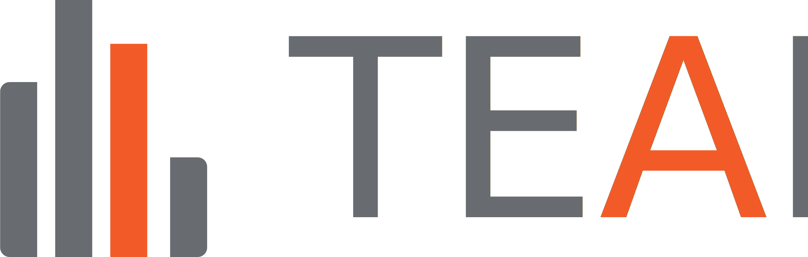
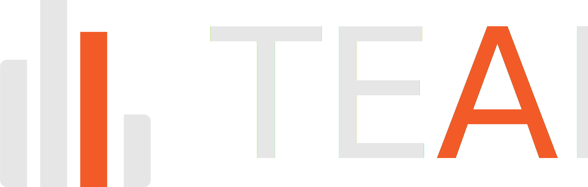

---
hide:
  - navigation
  - toc
---

  
  

# TEAM: Techno-economic assessment and manipulation framework

TEAM stands for **Techno-Economic Assessment and Manipulation** framework. It is pronounced the same way as the English word [team](https://dictionary.cambridge.org/pronunciation/english/team) /tiːm/.

TEAM is a framework for performing techno-economic assessments in the context of energy and climate-mitigation studies.

-   :material-book-open-variant:{ .lg .middle } __User Guide__

    ---

    Understand the basic concepts of TEAM.

    [:octicons-arrow-right-24: Read the guide](guide/overview.md)

-   :material-lightbulb-on:{ .lg .middle } __Examples__

    ---

    Look at examples of techno-economic assessments made with TEAM.

    [:octicons-arrow-right-24: Look at the examples](examples/index.md)

-   :material-file-code:{ .lg .middle } __API Reference__

    ---

    Inspect the functions and classes of the TEAM framework written in Python.

    [:octicons-arrow-right-24: Read the code docs](api/index.md)

## Credits and thanks

* The software code has been written by P.C. Verpoort.
* This work has been completed at the [Potsdam Institute for Climate Impact Research (PIK)](https://www.pik-potsdam.de/), a German research institute conducting integrated research for global sustainability.
* This work has been completed as part of the Ariadne project with funding from the German Federal Ministry of Research, Technology and Space (grant nos. 03SFK5A, 03SFK5A0-2).

## How to cite

* To cite a release (recommended), please refer to a specific version archived on Zenodo (which will soon be made available).
* To cite a specific commit, please refer to the citation information in [`CITATION.cff`](https://github.com/PhilippVerpoort/posted/blob/main/CITATION.cff) and include the commit hash.

## Licence

The software in this repository is licensed under an  [MIT Licence](https://github.com/PhilippVerpoort/posted/blob/main/LICENSE.md).
